# Vector_AI — Vector Database + RAG Engine from Scratch in Java

Zero-dependency **vector database** in pure Java. Three search engines (**HNSW**, **KD-Tree**, **Brute Force**) side by side, a live web UI, and a **RAG pipeline** powered by local LLMs through Ollama.

> Educational build showing how Pinecone, Weaviate, Chroma and Milvus work under the hood.


---

## Table of Contents

1. [Features](#features)
2. [System Architecture](#system-architecture)
3. [Request Flow](#request-flow)
4. [Document Ingestion Flow](#document-ingestion-flow)
5. [RAG Pipeline Flow](#rag-pipeline-flow)
6. [Algorithm Flowcharts](#algorithm-flowcharts)
7. [Class Structure](#class-structure)
8. [Tech Stack](#tech-stack)
9. [Setup](#setup)
10. [Usage](#usage)
11. [REST API](#rest-api)
12. [Project Structure](#project-structure)
13. [Troubleshooting](#troubleshooting)
14. [License](#license)

---

## Features

| Feature | Description |
|---|---|
| 3 search algorithms | HNSW, KD-Tree, Brute Force — run all three, compare speed |
| 3 distance metrics | Cosine, Euclidean, Manhattan |
| 16D demo vectors | 20 preloaded vectors across CS, Math, Food, Sports |
| PCA scatter plot | Live 2D projection of semantic space |
| Real embeddings | Any text → `nomic-embed-text` → 768D vector |
| RAG pipeline | Question → HNSW retrieval → `llama3.2` answer |
| REST API | Insert, delete, search, benchmark, hnsw-info, doc ingest, ask |

---

## System Architecture

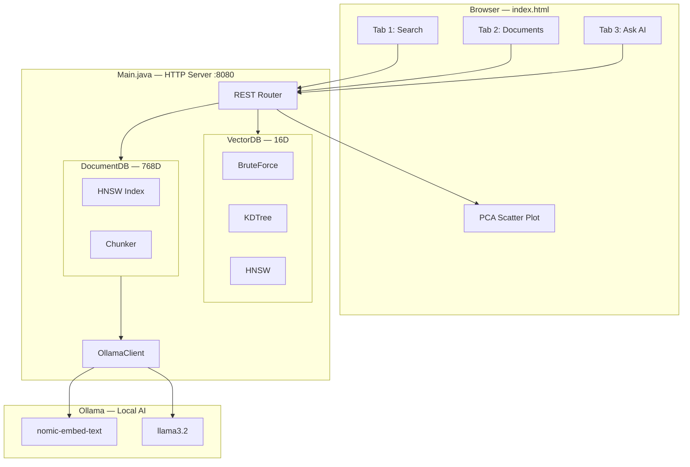

---

## Request Flow

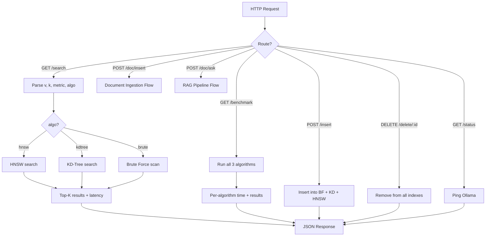

---

## Document Ingestion Flow


---

## RAG Pipeline Flow

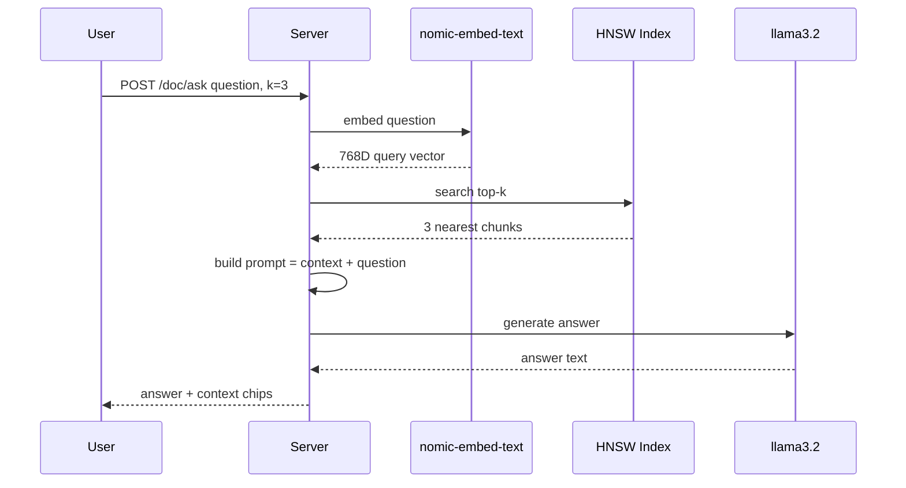

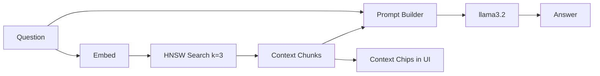

---

## Algorithm Flowcharts

### HNSW Insert

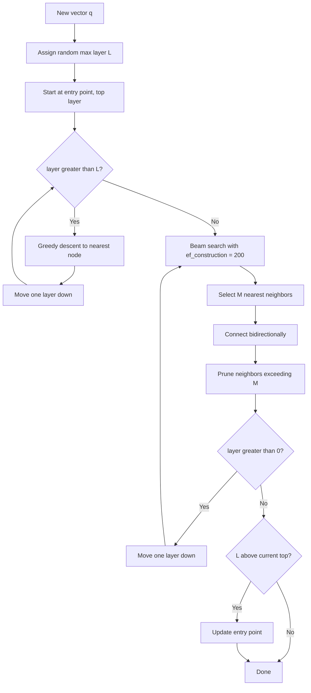

### HNSW Search

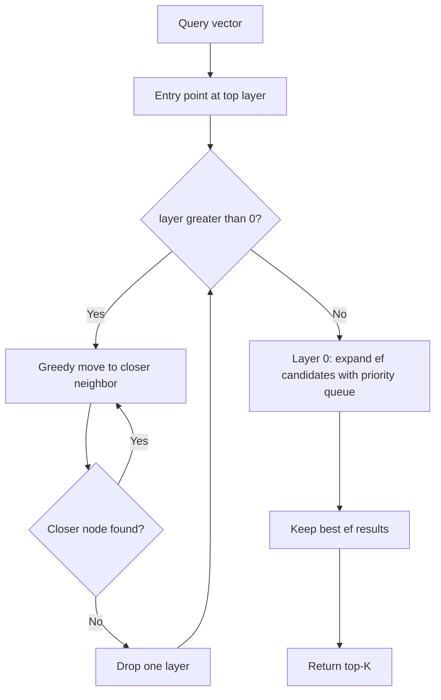

### KD-Tree Search

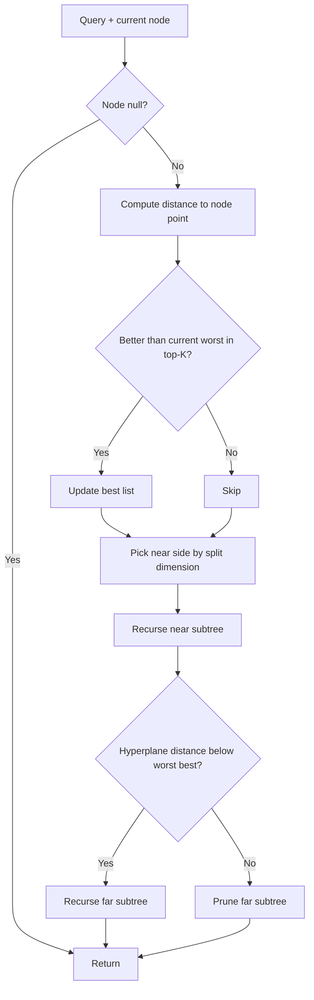

### Brute Force

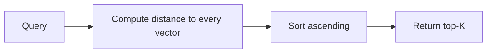

### Complexity

| Algorithm | Search | Exact | Best For |
|---|---|---|---|
| Brute Force | O(N·d) | Yes | Baseline, small data |
| KD-Tree | O(log N), degrades in high-D | Yes | Low dimensions (≤20D) |
| HNSW | O(log N) | Approximate | High dimensions, production |

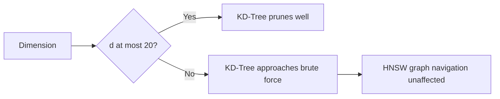

---

## Class Structure

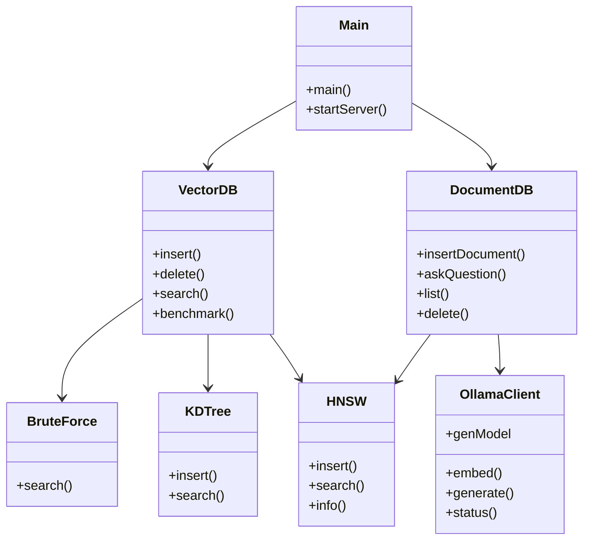

---

## Tech Stack

| Layer | Technology |
|---|---|
| Backend | Java 17+, built-in HTTP server, no external libraries |
| Indexes | HNSW, KD-Tree, Brute Force |
| Frontend | HTML, CSS, JavaScript, Canvas (PCA scatter plot) |
| Embeddings | Ollama `nomic-embed-text` (768D) |
| LLM | Ollama `llama3.2` |
| Visualization | PCA 16D → 2D |

---

## Setup

### Prerequisites

| Tool | Version |
|---|---|
| Java JDK | 17+ |
| Git | Any |
| Ollama | Latest, 8 GB RAM recommended |

### 1. Verify Java

```powershell
java -version
javac -version
```

Install from https://adoptium.net/ if missing.

### 2. Install Ollama and Pull Models

Download from https://ollama.com, then:

```powershell
ollama pull nomic-embed-text
ollama pull llama3.2
ollama list
```

### 3. Clone

```powershell
git clone https://github.com/krishkantrai27/Vector_AI.git
cd Vector_AI
```

### 4. Run

```powershell
javac Main.java
java Main
```

Or directly:

```powershell
java Main.java
```

Expected output:

```
=== VectorDB Engine (Java) ===
http://localhost:8080
20 demo vectors | 16 dims | HNSW+KD-Tree+BruteForce
Ollama: ONLINE
  embed model: nomic-embed-text  gen model: llama3.2
Server listening on port 8080...
```

Open http://localhost:8080

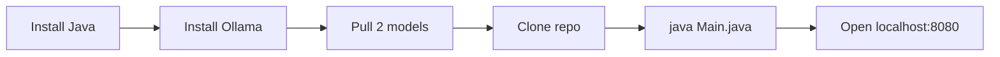

---

## Usage

### Tab 1 — Search

1. Enter a concept: `binary tree`, `sushi`, `basketball`, `calculus`
2. Pick algorithm: HNSW / KD-Tree / Brute Force
3. Pick metric: Cosine / Euclidean / Manhattan
4. Click **SEARCH** — results with distances, match glows on scatter plot
5. Click **COMPARE ALL ALGOS** — speed comparison of all three

### Tab 2 — Documents

1. Enter a title
2. Paste text
3. Click **EMBED & INSERT**
4. Text is split into overlapping 250-word chunks, each embedded and indexed in HNSW

### Tab 3 — Ask AI

1. Insert documents first
2. Type a question
3. Click **ASK AI**
4. Answer streams in; click context chips to inspect retrieved chunks

---

## REST API

Base URL: `http://localhost:8080`

### Demo Vectors

| Method | Endpoint | Description |
|---|---|---|
| GET | `/search?v=f1,f2,...&k=5&metric=cosine&algo=hnsw` | K-NN search |
| POST | `/insert` | Insert demo vector |
| DELETE | `/delete/:id` | Delete by ID |
| GET | `/items` | List all vectors |
| GET | `/benchmark?v=...&k=5&metric=cosine` | Compare 3 algorithms |
| GET | `/hnsw-info` | Graph structure, layer stats |
| GET | `/stats` | Database statistics |

### Documents and RAG

| Method | Endpoint | Body | Description |
|---|---|---|---|
| POST | `/doc/insert` | `{"title":"...","text":"..."}` | Embed and store |
| GET | `/doc/list` | — | List chunks |
| DELETE | `/doc/delete/:id` | — | Delete chunk |
| POST | `/doc/ask` | `{"question":"...","k":3}` | Retrieve + generate |
| GET | `/status` | — | Ollama status |

### Examples

```powershell
curl "http://localhost:8080/search?v=0.9,0.8,0.7,0.6,0.1,0.1,0.1,0.1,0.1,0.1,0.1,0.1,0.1,0.1,0.1,0.1&k=3&metric=cosine&algo=hnsw"
```

```powershell
curl -X POST http://localhost:8080/doc/ask `
  -H "Content-Type: application/json" `
  -d '{"question":"What is dynamic programming?","k":3}'
```

---

## Project Structure

```
Vector_AI/
├── Main.java       Backend: HNSW, KD-Tree, BruteForce, REST API, RAG
├── index.html      Frontend: PCA plot, chat UI, benchmark
└── README.md
```

---

## Troubleshooting

| Problem | Fix |
|---|---|
| `Ollama: OFFLINE` | Run `ollama serve` |
| First embed very slow | Model loading, wait ~2 min |
| `java: command not found` | Add JDK 17+ to PATH |
| Port 8080 busy | `netstat -ano \| findstr 8080` then `taskkill /PID <pid> /F` |
| Slow LLM answers | Use `llama3.2:1b` |

Faster model:

```powershell
ollama pull llama3.2:1b
```

In `Main.java`:

```java
public String genModel = "llama3.2:1b";
```

Recompile and restart.

---

## License

MIT
