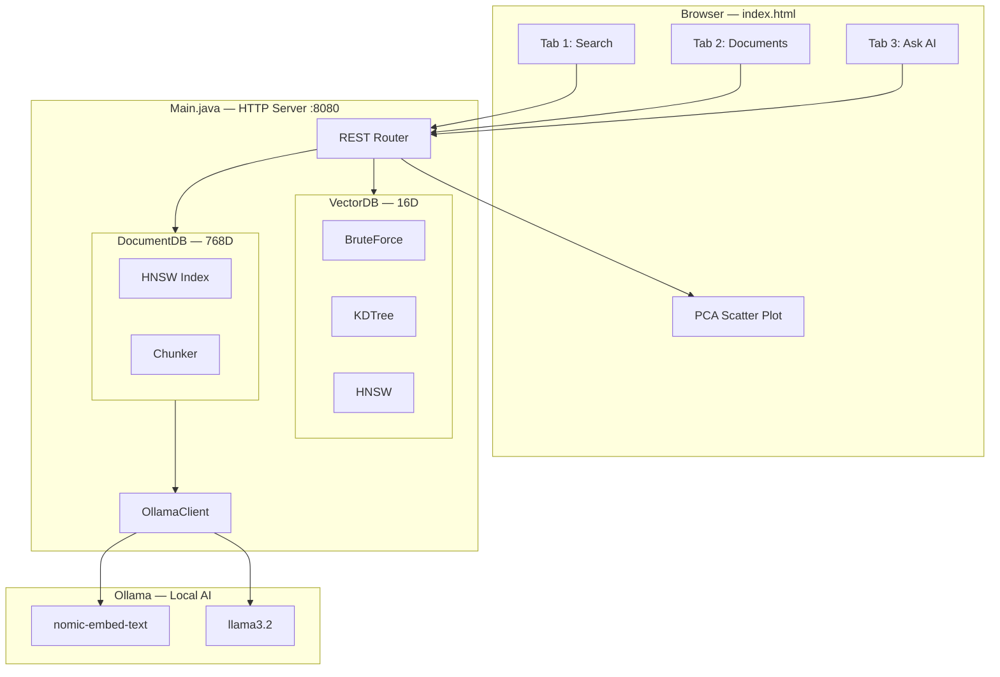
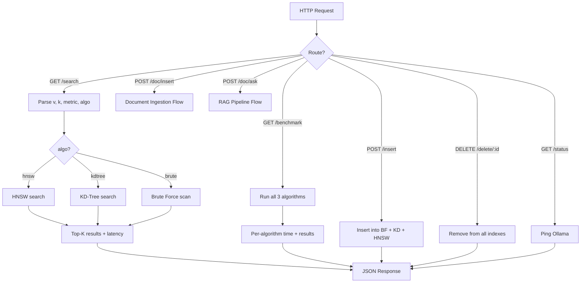
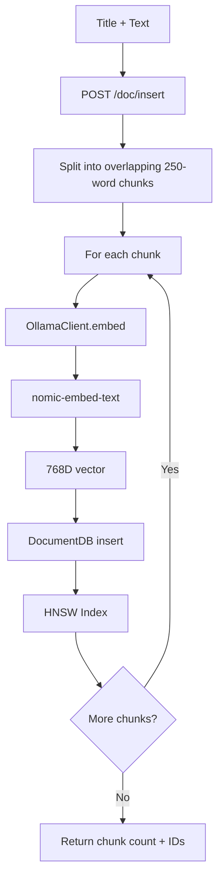
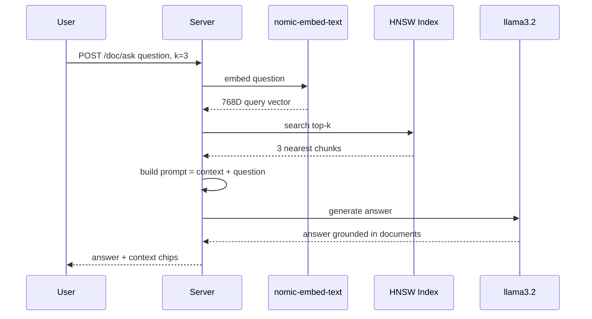
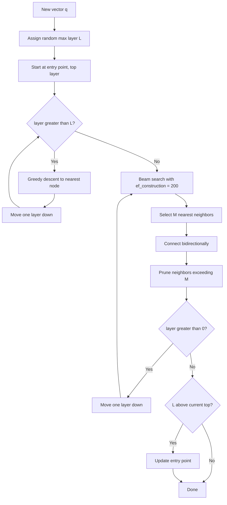
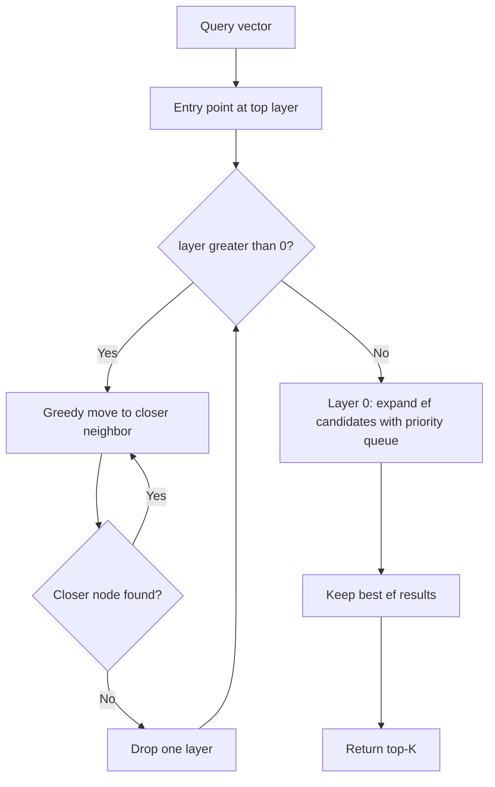
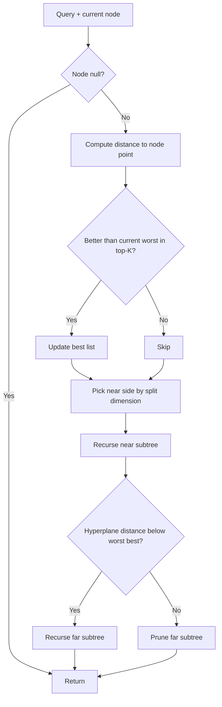
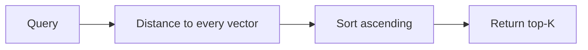
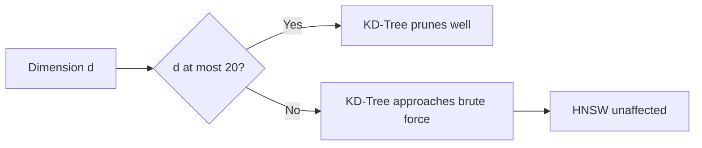
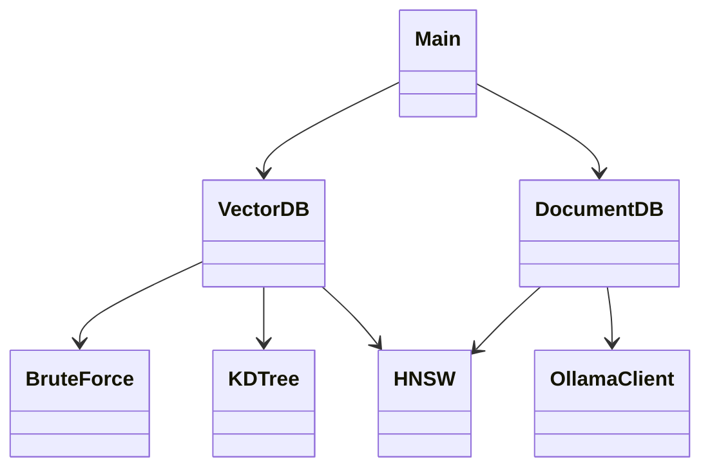

# Vector_AI — Vector Database + RAG Engine from Scratch in Java

Zero-dependency **vector database** in pure Java. **HNSW**, **KD-Tree** and **Brute Force** search side by side, live web UI with PCA visualization, and a **RAG pipeline** over local LLMs via Ollama.

> Built to understand how Pinecone, Weaviate, Chroma and Milvus work under the hood — every index and the HTTP server are written from scratch.


---

## At a Glance

| | |
|---|---|
| **Problem** | Understand and compare nearest-neighbor search used by production vector DBs |
| **Solution** | Three index implementations behind one API, plus an end-to-end RAG pipeline |
| **Stack** | Java 17+, built-in HTTP server, vanilla JS + Canvas, Ollama |
| **Dependencies** | None — no Maven, no Gradle, no frameworks |
| **Run** | `java Main.java` → `http://localhost:8080` |

### Engineering Highlights

- HNSW multilayer graph: greedy descent, beam search (`ef_construction=200`), bidirectional linking
- KD-Tree with hyperplane pruning; demonstrates curse of dimensionality against HNSW
- Pluggable distance metrics: Cosine, Euclidean, Manhattan
- Overlapping 250-word chunking + 768D embeddings (`nomic-embed-text`)
- RAG: query embedding → top-3 retrieval → grounded generation (`llama3.2`)
- REST API with CRUD, benchmark and graph-introspection endpoints
- Live PCA 16D → 2D scatter plot showing semantic clusters

---

## Table of Contents

1. [Quick Start](#quick-start)
2. [Features](#features)
3. [System Architecture](#system-architecture)
4. [Request Flow](#request-flow)
5. [Document Ingestion Flow](#document-ingestion-flow)
6. [RAG Pipeline Flow](#rag-pipeline-flow)
7. [Algorithms](#algorithms)
8. [Class Structure](#class-structure)
9. [Full Setup (Windows)](#full-setup-windows)
10. [Usage](#usage)
11. [REST API](#rest-api)
12. [Project Structure](#project-structure)
13. [Troubleshooting](#troubleshooting)
14. [Author](#author)
15. [License](#license)

---

## Quick Start

```powershell
ollama pull nomic-embed-text
ollama pull llama3.2
git clone https://github.com/krishkantrai27/Vector_AI.git
cd Vector_AI
java Main.java
```

Open http://localhost:8080

Requires Java 17+ and Ollama. Demo-vector search works without Ollama; Documents and Ask AI tabs need it.

---

## Features

| Feature | Description |
|---|---|
| 3 search algorithms | HNSW, KD-Tree, Brute Force — run all three, compare speed |
| 3 distance metrics | Cosine, Euclidean, Manhattan |
| 16D demo vectors | 20 preloaded vectors across CS, Math, Food, Sports |
| PCA scatter plot | Live 2D projection; four categories form distinct clusters |
| Real embeddings | Any text → `nomic-embed-text` → 768D vector |
| RAG pipeline | Question → HNSW retrieval → `llama3.2` answer with source chips |
| REST API | Insert, delete, search, benchmark, hnsw-info, doc ingest, ask |

---

## System Architecture



---

## Request Flow



---

## Document Ingestion Flow



---

## RAG Pipeline Flow



---

## Algorithms

### Overview

| Algorithm | Search | Exact | Best For |
|---|---|---|---|
| Brute Force | O(N·d) | Yes | Baseline, small data |
| KD-Tree | O(log N), degrades in high-D | Yes | Low dimensions (≤20D) |
| HNSW | O(log N) | Approximate | High dimensions, production |

### HNSW — Hierarchical Navigable Small World

Multilayer graph. Each node gets a random max layer. Layer 0 holds every node with dense links; upper layers are exponentially sparser with long-range links — a highway that gets the search near the target fast, then layer 0 refines it.





### KD-Tree

Binary space partitioning, cycling through dimensions. Search prunes a subtree when its closest possible point cannot beat the current best.



### Brute Force



### Why HNSW Wins at High Dimensions

KD-Tree pruning relies on axis-aligned bounds. In high dimensions almost all space sits near the hypersphere boundary, so nothing gets pruned and it degrades toward brute force at 768D. HNSW navigates a graph and is not tied to axis-aligned partitions.



---

## Class Structure



| Class | Role |
|---|---|
| `BruteForce` | Exact baseline, O(N·d) |
| `KDTree` | Exact, axis-aligned partitioning |
| `HNSW` | Approximate, multilayer small-world graph |
| `VectorDB` | Unified interface over all three (16D demo vectors) |
| `DocumentDB` | HNSW-only index for Ollama embeddings (768D) |
| `OllamaClient` | HTTP client → `/api/embeddings` + `/api/generate` |

---

## Full Setup (Windows)

### Prerequisites

| Tool | Version |
|---|---|
| Java JDK | 17+ |
| Git | Any |
| Ollama | Latest; 8 GB RAM recommended (~3 GB used by models) |

### 1. Verify Java

```powershell
java -version
javac -version
```

Install from https://adoptium.net/ if missing.

### 2. Install Git

Download from https://git-scm.com/download/win, then:

```powershell
git --version
```

### 3. Install Ollama and Pull Models

Download from https://ollama.com, then:

```powershell
ollama pull nomic-embed-text
ollama pull llama3.2
ollama list
```

`nomic-embed-text` ≈ 274 MB, `llama3.2` ≈ 2 GB.

### 4. Clone and Run

```powershell
git clone https://github.com/krishkantrai27/Vector_AI.git
cd Vector_AI
javac Main.java
java Main
```

Or in one step: `java Main.java`

Expected output:

```
=== VectorDB Engine (Java) ===
http://localhost:8080
20 demo vectors | 16 dims | HNSW+KD-Tree+BruteForce
Ollama: ONLINE
  embed model: nomic-embed-text  gen model: llama3.2
Server listening on port 8080...
```

---

## Usage

### Tab 1 — Search

1. Enter a concept: `Green Tea`, `Banana`, `Cricket`, `Differentiation`
2. Pick algorithm: HNSW / KD-Tree / Brute Force
3. Pick metric: Cosine / Euclidean / Manhattan
4. **SEARCH** — results with distances; match glows on scatter plot
5. **COMPARE ALL ALGOS** — speed comparison of all three

### Tab 2 — Documents

1. Enter a title, e.g. `Operating Systems Notes`
2. Paste lecture notes, textbook text or articles
3. **EMBED & INSERT**
4. Text is split into overlapping 250-word chunks; each is embedded and stored in HNSW

### Tab 3 — Ask AI

1. Insert documents first
2. Type a question
3. **ASK AI**
4. Answer streams in with typewriter effect; click context chips to inspect retrieved chunks

---

## REST API

Base URL: `http://localhost:8080`

### Demo Vectors

| Method | Endpoint | Description |
|---|---|---|
| GET | `/search?v=f1,f2,...&k=5&metric=cosine&algo=hnsw` | K-NN search |
| POST | `/insert` | Insert demo vector |
| DELETE | `/delete/:id` | Delete by ID |
| GET | `/items` | List all vectors |
| GET | `/benchmark?v=...&k=5&metric=cosine` | Compare 3 algorithms |
| GET | `/hnsw-info` | Graph structure, layer stats |
| GET | `/stats` | Database statistics |

### Documents and RAG

| Method | Endpoint | Body | Description |
|---|---|---|---|
| POST | `/doc/insert` | `{"title":"...","text":"..."}` | Embed and store |
| GET | `/doc/list` | — | List chunks |
| DELETE | `/doc/delete/:id` | — | Delete chunk |
| POST | `/doc/ask` | `{"question":"...","k":3}` | Retrieve + generate |
| GET | `/status` | — | Ollama status and models |

### Examples

```powershell
curl "http://localhost:8080/search?v=0.9,0.8,0.7,0.6,0.1,0.1,0.1,0.1,0.1,0.1,0.1,0.1,0.1,0.1,0.1,0.1&k=3&metric=cosine&algo=hnsw"
```

```powershell
curl -X POST http://localhost:8080/doc/ask `
  -H "Content-Type: application/json" `
  -d '{"question":"What is dynamic programming?","k":3}'
```

---

## Project Structure

```
Vector_AI/
├── Main.java       Backend: HNSW, KD-Tree, BruteForce, REST API, RAG
├── index.html      Frontend: PCA plot, chat UI, benchmark
└── README.md
```

---

## Troubleshooting

| Problem | Fix |
|---|---|
| `Ollama: OFFLINE` | Run `ollama serve` |
| First embed very slow | Model loading on first use, wait ~2 min |
| `java: command not found` | Add JDK 17+ to PATH |
| Port 8080 busy | `netstat -ano \| findstr 8080` then `taskkill /PID <pid> /F` |
| Slow LLM answers | Normal on laptop CPU (10–30 s); use `llama3.2:1b` |

Faster model:

```powershell
ollama pull llama3.2:1b
```

In `Main.java`:

```java
public String genModel = "llama3.2:1b";
```

Recompile and restart.

---

## Author

**Krish Kant Rai** — Full Stack Java Developer (Spring Boot, React.js, MySQL)
LinkedIn: [linkedin.com/in/krishkantrai](https://linkedin.com/in/krishkantrai) · GitHub: [krishkantrai27](https://github.com/krishkantrai27)

---

## License

MIT
